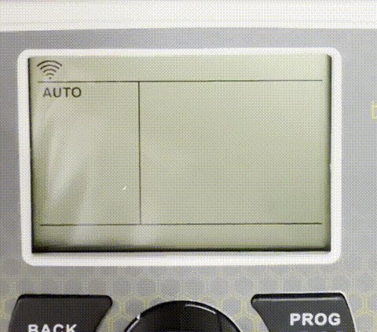
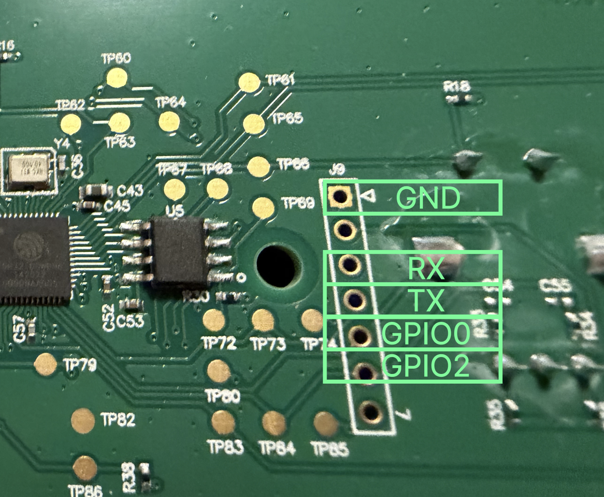

# Orbit B-Hyve to ESPHome Conversion

Convert your Orbit B-Hyve 6-station sprinkler controller (Model 57946) from cloud-dependent to **fully local control** with ESPHome and Home Assistant.




*ESPHome running on the B-Hyve — auto advance running zones 1 and 2 for 10 seconds*

## What This Project Delivers

After flashing, you get:

| Feature | Status |
|---------|--------|
| **6-zone valve control** | ✅ Full control via Home Assistant |
| **Per-zone run durations** | ✅ Configurable (persists across reboots) |
| **Auto-advance mode** | ✅ Runs zones sequentially |
| **Run time multiplier** | ✅ Scale all durations (e.g., 0.5x for light watering) |
| **LCD time remaining** | ✅ Shows MM:SS countdown |
| **LCD zone display** | ✅ Shows "STATION" + active zone number |
| **LCD WiFi indicator** | ✅ Shows connection status |
| **Front button** | ✅ Start/stop full watering cycle |
| **OTA updates** | ✅ Wireless firmware updates after initial flash |
| **Completion time** | ✅ Shows in Home Assistant (HH:MM:SS) |

## ⚠️ Not All Features Implemented

Not all stock B-Hyve functionality has been replicated:

- B-Hyve mobile app
- Cloud scheduling (use HA automations instead)
- Weather-smart watering (can replicate in HA)
- On-device programming via buttons
- Full button/LCD menu navigation
- Rain delay, freeze protection (implement via HA)
- Flow monitoring alerts
- Multiple program support (A/B/C)

For full product details, see [Orbit B-Hyve 57946 Product Page](https://www.orbitonline.com/products/b-hyve-6-station-smart-indoor-sprinkler-timer).

If you want a standalone smart sprinkler controller, keep the stock firmware. Use if you want Home Assistant integration and don't mind losing on-device configuration.

## 📋 Compatibility

**Tested on:** Orbit B-Hyve 6-Station Indoor Timer (Model 57946)

| Component | Details |
|-----------|---------|
| MCU | ESP32-D0WDQ6 (revision v1.0/v1.1) |
| Flash | 4MB Adesto AT25SF321 (JEDEC: 0x1f 0x8701) |
| LCD | CS1622 segment controller |
| Valves | SN74HC595 shift register (6 zones) |


## Why Do This?

- **No cloud dependency** — works offline, no Orbit servers needed
- **Home Assistant integration** — full entity control, automations, dashboards
- **Hackable** — add weather-based watering, soil sensors, whatever
- **OTA updates** — flash over WiFi after the first time
- **No subscriptions** — your hardware, own it
- **Privacy** — no data sent to third parties

## Flashing Guide

### 1. Install Dependencies

```bash
python3 -m venv .venv
source .venv/bin/activate
pip install -r requirements.txt
```

### 2. Connect UART and Enter Download Mode

You'll need a USB-to-UART adapter.

| Signal | ESP32 Pin | Notes |
|--------|-----------|-------|
| TX | GPIO1 | ESP32 TX → Adapter RX |
| RX | GPIO3 | ESP32 RX → Adapter TX |
| GND | GND | Common ground |

To enter download mode, hold GPIO0 and GPIO2 to GND while powering on.



*UART connection points on the main board*

You can power the B-Hyve from its normal 24VAC supply while using UART.

To confirm you're connected and in download mode:
```bash
screen /dev/cu.usbserial-0001 115200
# You should see boot messages confirming the boot mode is download
# Press Ctrl-A then K to exit screen
```

### 3. Backup Original Firmware

Do this before flashing so you can restore later.

```bash
# Verify connection (should show ESP32-D0WDQ6)
esptool.py --chip esp32 --port /dev/cu.usbserial-0001 flash_id

# Backup full flash (4MB)
esptool.py --chip esp32 --port /dev/cu.usbserial-0001 read_flash 0x0 0x400000 full_bhyve_backup.bin

# Backup bootloader and partitions separately
esptool.py --chip esp32 --port /dev/cu.usbserial-0001 read_flash 0x1000 0x7000 bootloader.bin
esptool.py --chip esp32 --port /dev/cu.usbserial-0001 read_flash 0x8000 0x1000 partitions.bin
```

### 4. Configure secrets.yaml

```yaml
wifi_ssid: "your-wifi-name"
wifi_password: "your-wifi-password"
api_key: "your-32-char-base64-key"  # Generate: openssl rand -base64 32
ota_password: "your-ota-password"
```

### 5. Flash

```bash
esphome run bhyve.yaml --device /dev/cu.usbserial-0001
```

Home Assistant will auto-discover the device. Add it using your API key from `secrets.yaml`.


*Sprinkler entities in Home Assistant*

Done! 🎉

---

### Future Updates (OTA)

After the initial flash, updates are wireless:
```bash
esphome run bhyve.yaml
# Select the device from the list (e.g., orbit-bhyve.local)
```

### Restore Original Firmware

If you want to go back to stock:
```bash
esptool.py --chip esp32 --port /dev/cu.usbserial-0001 write_flash 0x0 full_bhyve_backup.bin
```


## Hardware Pin Mapping

Discovered through boot log analysis and multimeter tracing:

### Valve Control (SN74HC595)
| 595 Pin | Function | ESP32 GPIO |
|---------|----------|------------|
| Pin 14 | SER (Data) | GPIO32 |
| Pin 11 | SRCLK (Clock) | GPIO25 |
| Pin 12 | RCLK (Latch) | GPIO33 |
| Pin 13 | OE (Enable) | GPIO26 |

### LCD Controller (CS1622)
| Function | ESP32 GPIO |
|----------|------------|
| CS | GPIO21 |
| WR | GPIO0 (⚠️ boot strapping pin) |
| DATA | GPIO32 (shared with shift register) |

### Buttons (partially mapped)
| Button | ESP32 GPIO | Status |
|--------|------------|--------|
| Front Button | GPIO5 | ✅ Mapped |
| Others | GPIO2, 4, 18, 19, 23, 27 | 🔄 TBD |

### Sensors (not implemented)
| Sensor | ESP32 GPIO | Status |
|--------|------------|--------|
| Rain Sensor | GPIO35 | 🔄 Hardware present |
| Flow Sensor | GPIO34 | 🔄 Hardware present |

## Known Issues

### Flash Detection (Adesto AT25SF321)
The flash chip isn't in ESP-IDF's database. We force legacy driver:
```yaml
sdkconfig_options:
  CONFIG_SPI_FLASH_USE_LEGACY_IMPL: y
  CONFIG_SPI_FLASH_SUPPORT_ATMEL_CHIP: y
```

### GPIO0 Boot Conflict
GPIO0 controls boot mode but is used for LCD. The driver delays initialization by 1 second to avoid issues.

### MAC Address Errors
The ESP32 may report eFuse MAC errors. Fixed with:
```yaml
advanced:
  ignore_efuse_custom_mac: true
  ignore_efuse_mac_crc: true
```

## Project Structure

```
├── bhyve.yaml          # Main ESPHome configuration
├── cs1622.h            # Custom LCD driver (segment mapping)
├── secrets.yaml        # WiFi/API credentials (git-ignored)
├── full_bhyve.bin      # Original firmware backup
├── bootloader.bin      # Original bootloader
├── partitions.bin      # Original partition table
├── requirements.txt    # Python dependencies
└── README.md           # This file
```

## Future Work

- [ ] Map remaining physical buttons
- [ ] Rain sensor integration
- [ ] Flow sensor integration  
- [ ] Pump relay control
- [ ] Additional LCD icons (rain, pump, etc.)

## Acknowledgments

- Built with [ESPHome](https://esphome.io/) and [Home Assistant](https://www.home-assistant.io/)
- Reverse engineered with patience, a multimeter, and log analysis
- LCD driver inspired by HT1621 implementations

## Legal

### License
GPL-3.0 — see [LICENSE](LICENSE).

### Disclaimer
- Not affiliated with or endorsed by Orbit Irrigation Products, Inc.
- Modifying your device will void your warranty
- You are solely responsible for any damage to your hardware or property
- Improper installation of irrigation systems can cause water damage
- This software is provided "as is" without warranty of any kind

### Reverse Engineering Notice
This project was created through clean-room reverse engineering of publicly observable behavior (boot logs, GPIO tracing). No proprietary code or firmware was decompiled or disassembled.

---

**Questions?** Open an issue on GitHub.

**Made with 💧 for the Home Assistant community**
